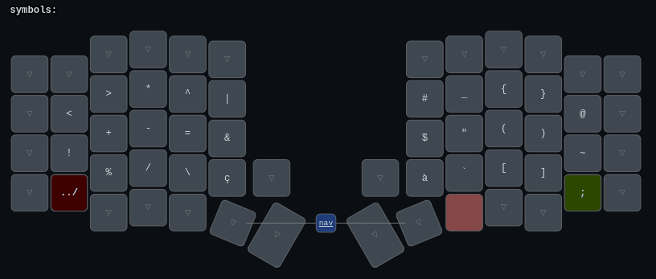
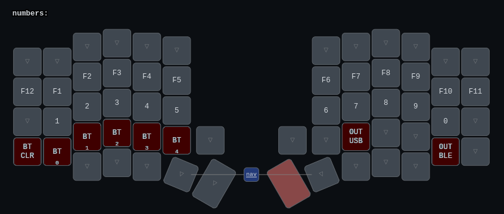

# ZMK Keymap for Sofle Split Keyboard

This my custom ZMK keymap designed for the Sofle Split Keyboard. [It can also be used with smaller boards](#modularity) like the corne. The keymap focuses on daily use, development, and gaming, while ensuring ergonomic and efficiency.

## Representation

### Color Legend

- 🟩 Redundant (oplional) keys
- 🟨 Optional (gaming-only) keys
- 🟥 Controversial/optional/movable keys

## Idea

The keymap is designed with the following goals in mind:

- **Compatibility across PCs**: Converts QWERTY and AZERTY layouts to **Colemak-DH**.
- **Ergonomics and Efficiency**: Reduces (inconfortable) finger movements.
- **No Homerow Mod**: Prevents accidental shortcut activations. (although Shift is set on the space key: worst case you type a word in PascalCase)
- **Common Shortcuts**: Keeps all necessary shortcuts easily accessible and add redundancy for modifiers just in case.
- **Language-Specific Keys**: Maintains support for keys used in french.
- **Gaming Layer**: Dedicated gaming layer for keybinding compatibility with games.

## Modularity

This keymap is highly customizable. Here are some suggestions for modifications:

- **Remove Top Row**: If you're using a smaller keyboard, you can remove the top row, as it is only meant to be used while gaming.
- **Remove Direct Gaming Layer Access + Right Ctrl**: If you have a smaller thumb cluster, you can moove the gaming layer in the layout rotation.
- **Homerow Mod**: If you prefer using the homerow mod, you can replace mod taps on the thumb cluster with this method.
- **Switching Symbols**: Depending on what programming language you use, or for easier memorization, you can switch the symbols layer around.
- **Using a different layout**: You can switch to a different layout, any alternative layout will be a bing improvement over QWERTY/AZERTY so just pick one and enjoy.
- **Remove rotary encoders/display**: If you don't have rotary encoders or a display, you can simply remove their configurations.
- **Swapping Thumb Clusters**: Swap the thumb clusters of hands.

## Improvements

Feel free to make improvements or share any feedback. This keymap is still WIP, and I’m open to suggestions.

## Inspirations/References

- [Colemak-DH](https://colemakmods.github.io/mod-dh/)
- [ZMK](https://zmk.dev/docs)
- [Symbol layer](https://getreuer.info/posts/keyboards/symbol-layer/index.html)
- [Keymap Drawer](https://caksoylar.github.io/keymap-drawer/)
